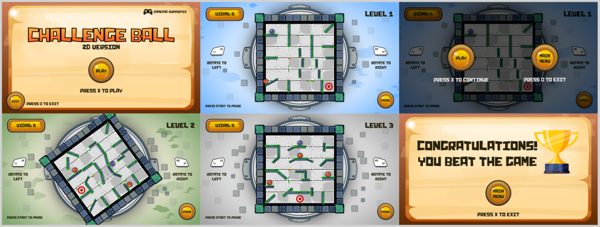

# Jogo Challenge Ball 2D Version

O jogo consiste em direcionar uma bola (personagem) até um alvo sem deixá-la encostar em outras bolas inimigas. Ao alcançar o alvo, um outro nível é carregado com mais bolas inimigas gerando uma maior dificuldade. As bolas são direcionadas rotacionando-se o cenário com as setas do teclado, botões do touch ou botões do gamepad.

## Como surgiu

Após a implementação do jogo Challenge Ball 3D Version, surgiu a ideia de fazer uma versão 2D com gráficos vetoriais.

## Screenshots

## Plataformas

Windows, Web e Android

## Controles

Teclado e Mouse:

- Setas direcionais direita e esquerda rotacionam o cenário.
- Tecla Esc aciona o menu pause
- Botão esquerdo do mouse aciona as opções de click

Gamepad/Joystick:

- Botões L1/LB e R1/RB rotacionam o cenário para a esquerda e direita, respectivamente.
- Botão Start aciona o menu pause
- Botões X/A e O/B acionam as opções de click

## Download

O jogo pode ser jogado online e baixado no link: https://henriqueneto.itch.io/challenge-ball-2d

## Contatos

- Email: henrique.neto.dev@gmail.com
- Instagram: https://www.instagram.com/arte.henrique.neto
